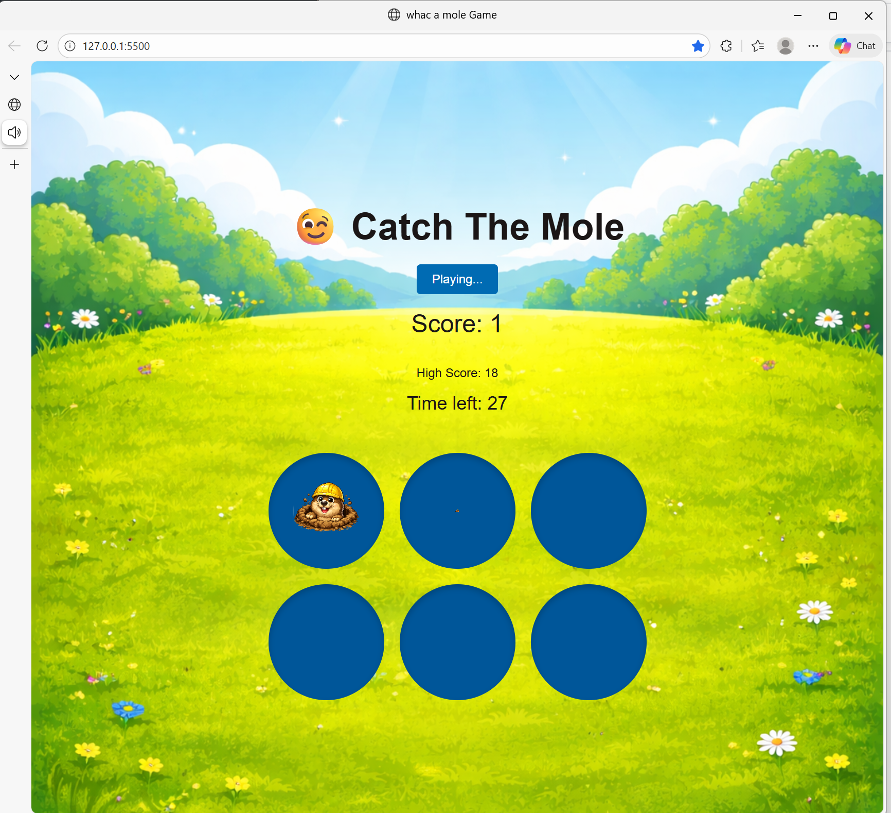

# 🐹 WhacaMole – Browser Game
[](https://reshmakul.github.io/WhacaMole/)
An interactive Whac-A-Mole game built with HTML, CSS, and vanilla JavaScript.

This project showcases core front-end development skills including DOM manipulation, event-driven programming, timer logic, and structured state management — implemented without external libraries.

---

## 🚀 Tech Stack

- HTML5  
- CSS3  
- JavaScript (ES6)

---

## 🎮 Key Features

- Randomized mole appearance logic  
- Real-time score tracking  
- Countdown timer  
- Integrated sound effects  

---

## 📸 Screenshot



---

## ▶️ Run Locally

```bash
git clone https://github.com/reshmakul/WhacaMole.git
cd WhacaMole
